Software Engineer at [Automattic](https://automattic.com) | [WooCommerce](https://woocommerce.com). Building and sharing what I learn.

---

### What I'm Working On

<!-- RECENT-REPOS:START -->
| Repository | Commits (90d) |
|---|---|
| [woocommerce/woocommerce-ios](https://github.com/woocommerce/woocommerce-ios) | 296 |
| [staskus/Pomafocus](https://github.com/staskus/Pomafocus) | 125 |
| [staskus/dreamspaces](https://github.com/staskus/dreamspaces) | 44 |
| [staskus/iosforge](https://github.com/staskus/iosforge) | 27 |
| [woocommerce/woocommerce-android](https://github.com/woocommerce/woocommerce-android) | 23 |
| [staskus/QuickBaby](https://github.com/staskus/QuickBaby) | 14 |
| [staskus/staskus](https://github.com/staskus/staskus) | 9 |
| [woocommerce/woocommerce](https://github.com/woocommerce/woocommerce) | 2 |
| [notmattpress/poocommerce](https://github.com/notmattpress/poocommerce) | 2 |
| [staskus/AgentsHub](https://github.com/staskus/AgentsHub) | 2 |
<!-- RECENT-REPOS:END -->

---

### Recent GitHub Activity

<!--START_SECTION:activity-->
1. ℹ️ Assigned PR [#16757](https://github.com/woocommerce/woocommerce-ios/pull/16757) in [woocommerce/woocommerce-ios](https://github.com/woocommerce/woocommerce-ios)
2. 🎉 Merged PR [#16758](https://github.com/woocommerce/woocommerce-ios/pull/16758) in [woocommerce/woocommerce-ios](https://github.com/woocommerce/woocommerce-ios)
3. 🗣 Commented on [#16758](https://github.com/woocommerce/woocommerce-ios/pull/16758#issuecomment-4002230191) in [woocommerce/woocommerce-ios](https://github.com/woocommerce/woocommerce-ios)
4. 🎉 Merged PR [#16676](https://github.com/woocommerce/woocommerce-ios/pull/16676) in [woocommerce/woocommerce-ios](https://github.com/woocommerce/woocommerce-ios)
5. 🎉 Merged PR [#15272](https://github.com/woocommerce/woocommerce-android/pull/15272) in [woocommerce/woocommerce-android](https://github.com/woocommerce/woocommerce-android)
<!--END_SECTION:activity-->

---

### Latest Blog Posts

<!-- BLOG-POST-LIST:START -->
- [📝 Understanding LLMs: Notes on Language Model basics](https://staskus.io/2025/12/15/%f0%9f%93%9d-understanding-llms-notes-on-language-model-basics/)
- [📝 Understanding LLMs: Notes on ML basics](https://staskus.io/2025/11/29/understanding-llms-notes-on-ml-basics/)
- [Learning Week 47 2025: Brains-On AI, Long-Term Thinking, Netflix &amp; Kotlin](https://staskus.io/2025/11/23/what-i-learned-week-47-2025/)
- [When the world zigs, zag](https://staskus.io/2025/11/01/when-the-world-zigs-zag/)
- [It was a coincidence](https://staskus.io/2024/01/06/it-was-a-coincidence/)
<!-- BLOG-POST-LIST:END -->

---

### Contribution Metrics

  

---

### Stats

  
  

